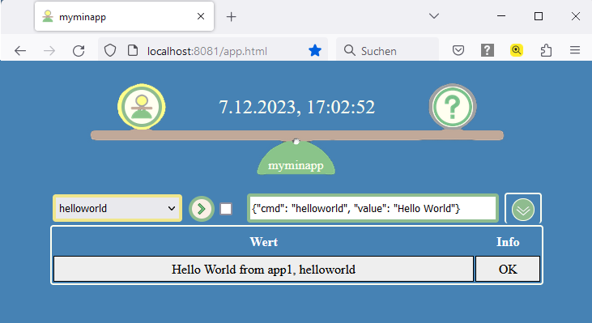

# My Minimal Application (myminapp)

 

- Documentation: /doc/myminapp-manual-de.pdf, /doc/myminapp-manual-en.pdf
- License: MIT
- Author: berryunit

'myminapp' ist eine minimale aber vollständige Python-Applikation, die beispielhaft veranschaulicht, wie kleine DIY-Projekte im Heimbereich mit geringem Aufwand programmiert werden können.

Sie bietet die folgenden Features out-of-the-box:

- Komplette, transparente Applikationsstruktur mit Commands, Logging und Datenspeicher
- Einfache Anwendung via Python Shell sowie Einbindung in Scripts und Programme
- Applikationsserver und Web-Frontend für HTTP(S)-Anfragen
- Zeitgesteuerte Automatisierung
- Mehrsprachige Nachrichten
- Diverse Commands, die direkt nützlich sein oder als Muster dienen können
- Einfache Erweiterbarkeit zur Umsetzung individueller Aufgaben

Vorausgesetzt wird ein Rechner, auf dem Python ab Version 3.10 läuft. Für SBCs wie Raspberry Pi ist eine USB-SSD zu empfehlen, da SD-Karten für den Dauerbetrieb nicht geeignet sind.

Um die Applikation zu installieren und den Command 'helloworld' auf unterschiedliche Art auszuführen, kann wie folgt vorgegangen werden.

## Schritt 1 - myminapp installieren

Die Releasedatei 'myminapp-*Versionsnummer*.zip' von https://github.com/berryunit/myminapp herunterladen und in ein Verzeichnis mit Schreib- und Leserechten entpacken.

*Hinweis: Als Beispiel-Applikation sollte myminapp aus der Release-Datei in ein Benutzerverzeichnis entpackt werden. Dies ist der einfachste Weg, um auf den Quellcode zuzugreifen. Alternativ kann die Installation via pip erfolgen.*

Im Folgenden wird angenommen, dass das in der Releasedatei enthaltene Applikationsverzeichnis 'myminapp' vom Benutzer 'u1' nach  '/home/u1/' gestellt wurde. Außerdem wird angenommen, dass Python Version 3 auf dem System mit 'python3' aufzurufen ist.

## Schritt 2 - Command 'helloworld' via Python-Shell ausführen

### 2.1 Die Python shell starten

im Verzeichnis 'home/u1' (oberhalb von myminapp) eingeben:

	python3

### 2.2 Innerhalb der Python-Shell eingeben:

    from myminapp.app import App
    app1 = App(1)
    app1.perform_command({'cmd':'helloworld', 'value':'Hello World'})
    app1.close()

### 2.3 Die Python-Shell verlassen mit:

	exit()

## Schritt 3 - Anfragen via Applikationsserver ausführen

Den Applikationsserver im Verzeichnis 'home/u1' (oberhalb von myminapp) starten. Dazu eingeben:

	python3 -m myminapp.appserver
 
### 3.1 - Command 'helloworld' via CURL ausführen

Ein weiteres Terminal öffnen und die folgende Eingabe machen:

	curl --get --data-urlencode '{"cmd": "helloworld", "value": "Hello World"}' http://localhost:8081

### 3.2 - Command 'helloworld' via Browser-URL-Zeile ausführen

Einen Browser öffnen und in die URL-Zeile eingeben:

	http://localhost:8081/{"cmd": "helloworld", "value": "Hello World"}

### 3.3 - Command 'helloworld' via Web-Frontend ausführen

#### Einen Browser öffnen und in die URL-Zeile eingeben:

http://localhost:8081/app.html

#### Den Command 'helloworld' auswählen und den Befehlsausführungs-Button drücken.

Beispiel-Bild (Mozilla Firefox, myminapp-Spracheinstellung 'de'):

Den Applikationsserver durch folgende Eingabe im Terminal beenden:

	Strg+C

## Schritt 4 - Command 'helloworld' via Testklasse ausführen

Im Verzeichnis 'home/u1' (oberhalb von myminapp) eingeben:

	python3 -m myminapp.test.command.test_helloworld

**Alle weiteren Informationen enthält das Handbuch:**

- /doc/myminapp-manual-de.pdf
- /doc/myminapp-manual-en.pdf
